**The following document is a revised step-by-step guide, originally
created for this video : <https://www.youtube.com/watch?v=Ho8dSqwX4-Q>
(posted by [Driver 732)]{.underline}**

**GENERATE CANBOOT FIRMWARE**

Type: '*git clone https://github.com/Arksine/CanBoot*' to download
CanBoot by Arksine

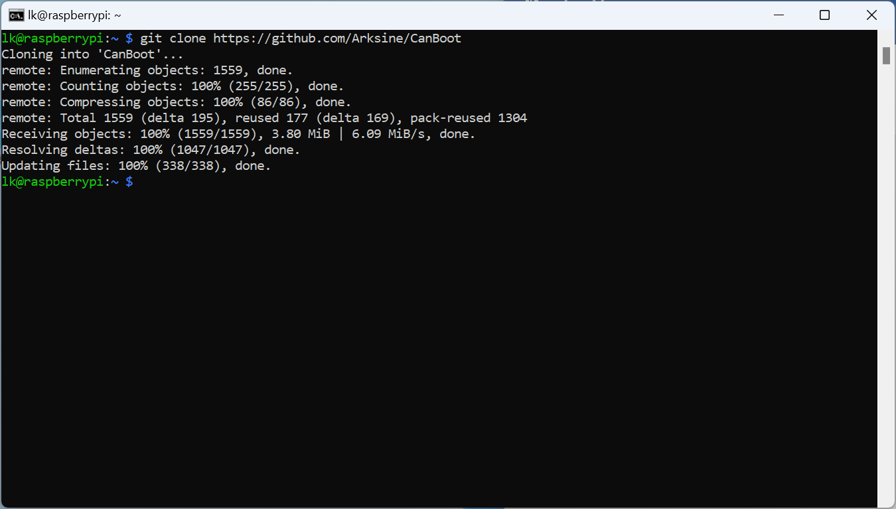

Type: '*cd CanBoot*' and '*make menuconfig*' to enter the CanBoot
Configuration. Note that Linux is case sensitive and typing: '*canboot*'
will throw an error.

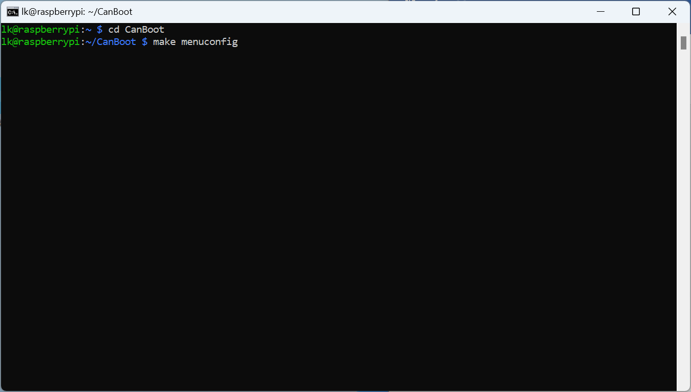

There are several lines to change. Micro-controller Architecture to
'STMicroelectronics STM32', Processor model to (controller chipset), and
Clock Reference to '12 MHz crystal'. These are specifically for my
Octopus Pro F446. Screenshot of my settings:

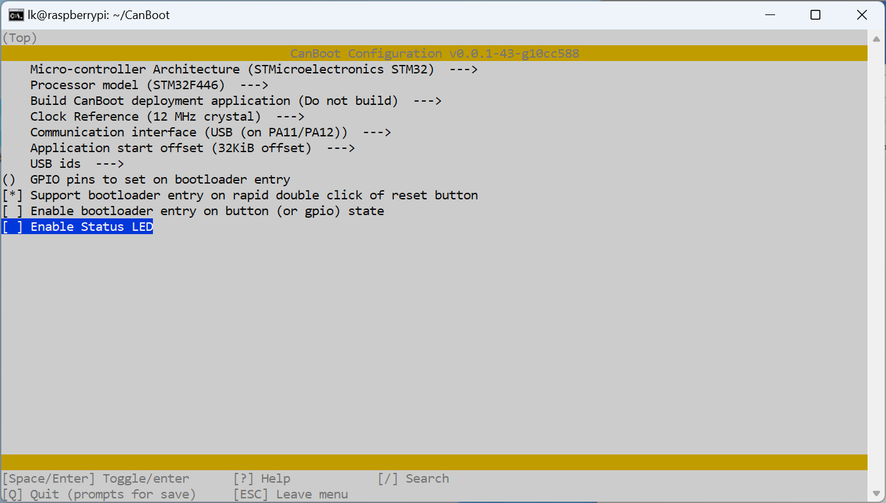

The processor model is labeled on the chip.

Type: '*q*' then '*y*' to save.

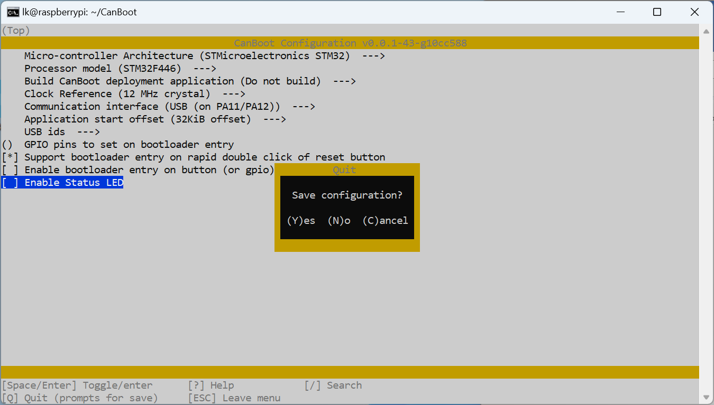

Type: '*make*' which compiles the firmware into a subdirectory called
'out'.

Type: '*cd out*' which navigates to the subfolder and '*ls -l*' lists
the generated files. The 'canboot.bin' file is here and typing: '*pwd*'
lists the full path which can be used for file copying.

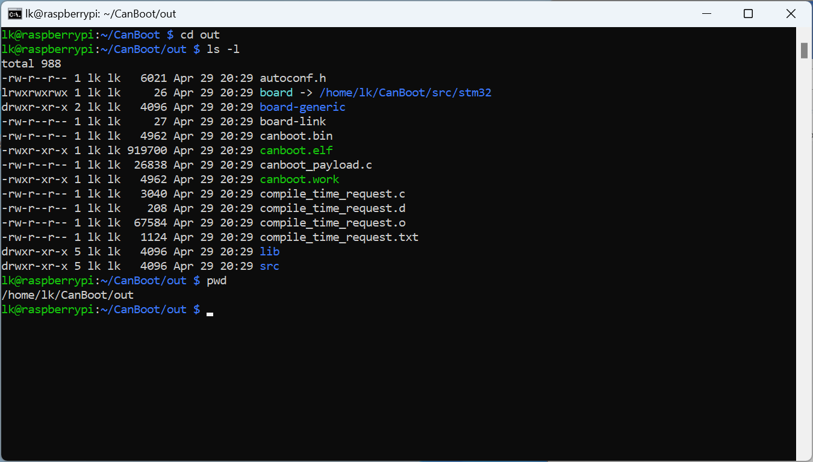

This entire directory gets overwritten once we re-run menuconfig, so
rename 'canboot.bin' to 'octopus_canboot.bin' or similar. Type: '*mv
canboot.bin octopus_canboot.bin'* to rename the file.

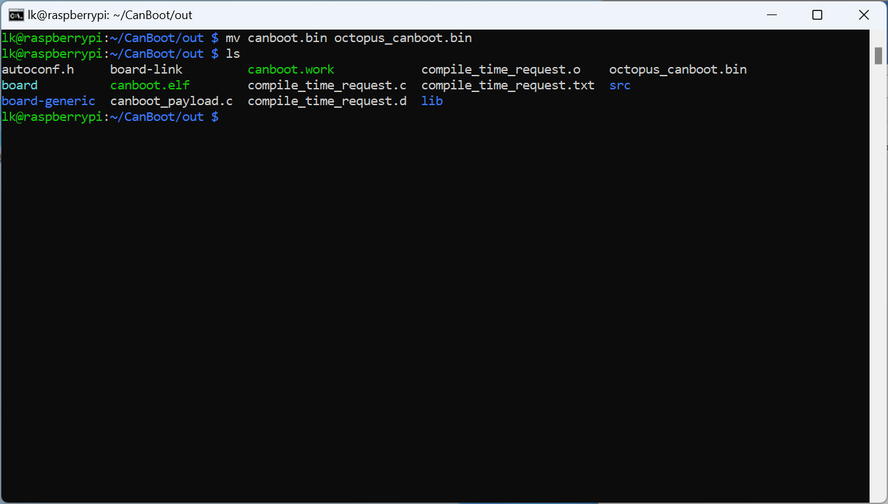

From your Windows machine, download and run WinSCP. Connect using your
Pi's IP address and simply move the 'octopus_canboot.bin' file over to
the Desktop. Reference the full file path from earlier to locate the
.bin file.

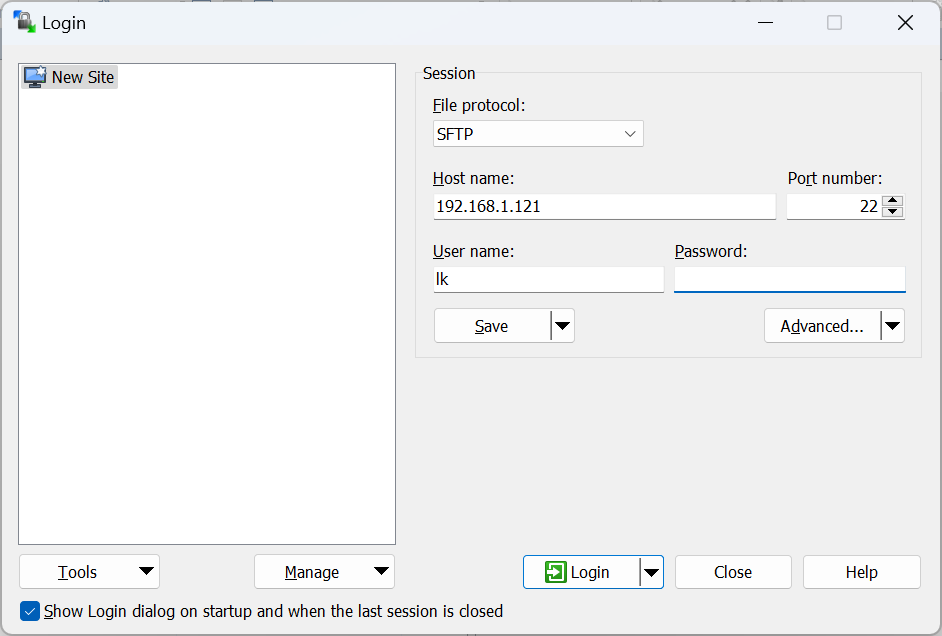

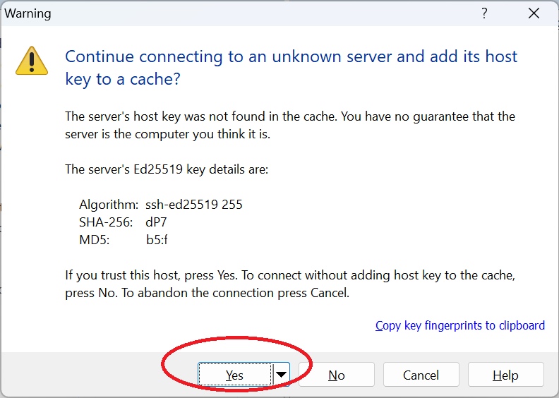

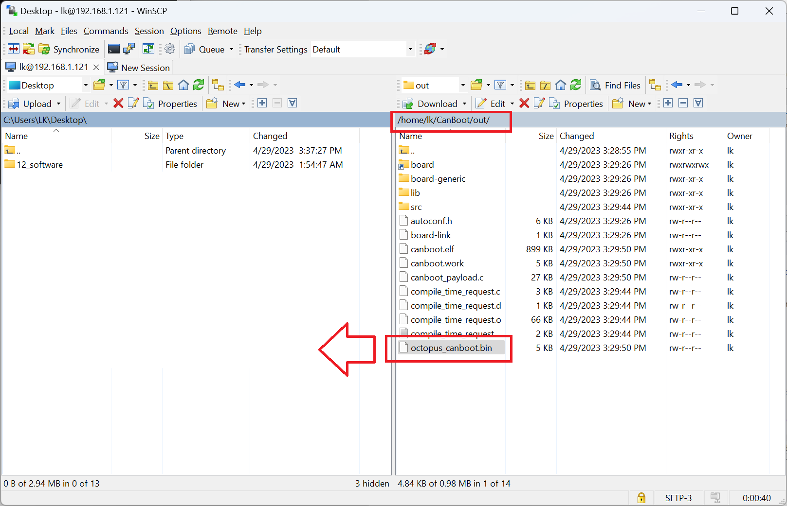

Back in CMD, make sure you are in the right directory. Type: *'cd
\~/CanBoot'*

Type: *'make clean'* followed by *'make menuconfig'*

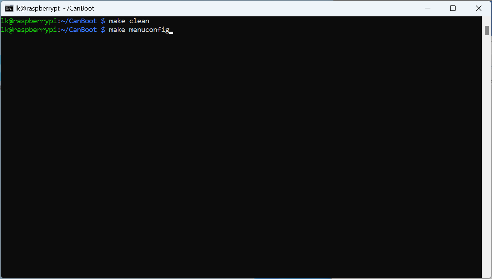

Repeat for the EBB42 v1.2 board. Note that I am using the default CAN
bus speed of 500000. This number should not be set lower, especially if
using ADXL input shaping. Some have had better luck increasing this to
1000000, which may resolve certain data communication issues.

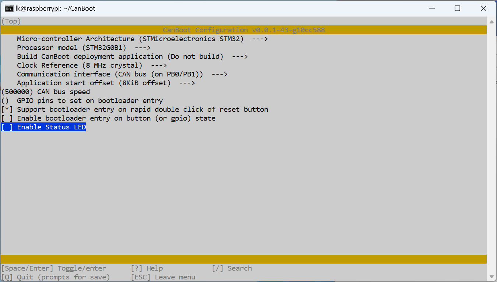

Quit and save. Type: *'make'* to generate a new firmware which saves to
the same 'out' subdirectory.

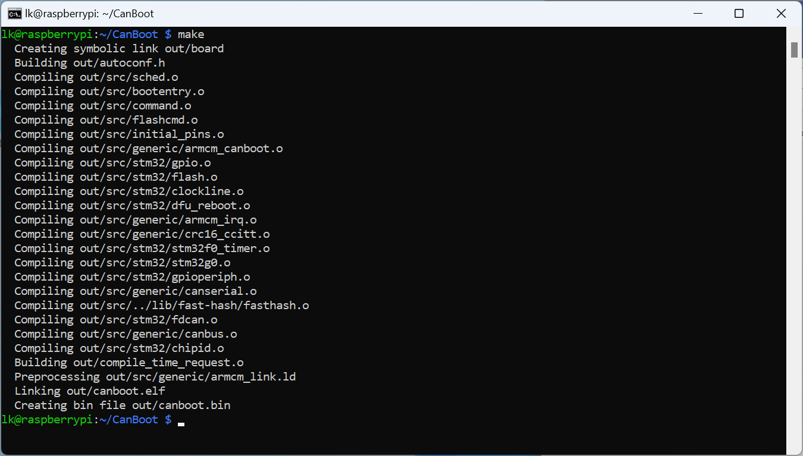

Navigate to the subdirectory and rename this new 'canboot.bin' file to
'ebb42_canboot.bin' or similar. Copy this file over to Windows Desktop
using WinSCP.

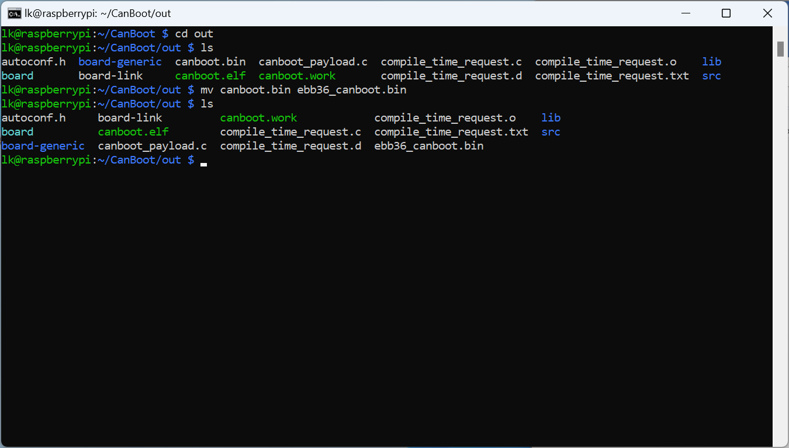

**FLASH CANBOOT FIRMWARE**

**If you did not read the disclaimer at the beginning, please do so
before proceeding.**

Download STM32CubeProgrammer:

<https://www.st.com/en/development-tools/stm32cubeprog.html#get-software>

At this time, version 2.13.0 will *not* work and must be downgraded for
the firmware flash to work. I am using version 2.8.0. Accept all
installation defaults and dependency packages (not shown).

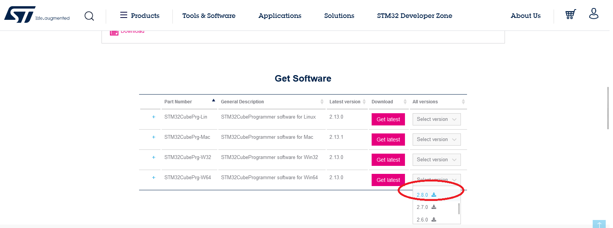

Unless the Octopus is powered by the 24V PSU, you need jumpers installed
on BOTH the 'USB-C Power' AND 'Boot0' pins on the board. Otherwise, a
USB A to C cable connected from the Windows computer is not powerful
enough. This is contrary to many guides stating to remove the 'USB-C
Power' jumper. Remove all other jumpers and motor drivers if you have
difficulty powering the board.

Press and hold the reset button for at least five seconds to set the
Octopus to DFU mode.

Start the STM32CubeProgrammer software. The following steps do not work
if the software is started before setting the board in DFU mode. Click
'Connect'. Status should change from 'Not connected' to 'Connected'
which reads the memory contents.

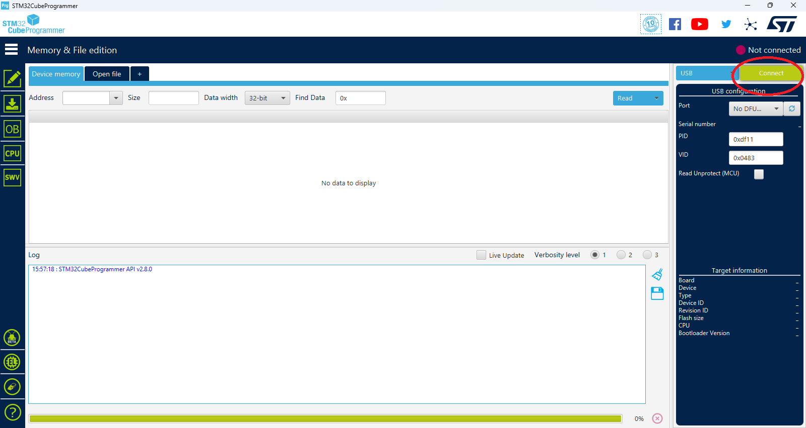

Erase by clicking the icon on the left, clicking 'Erase external memory'
and then 'Full chip erase'. I could not grab proper screenshots, so you
will see much more information. It will prompt to 'erase full chip flash
memory' and once finished, notify that 'Mass erase command correctly
executed'. Be aware of error messages that may indicate problems with
the process or a botched attempt. You may need to repeat this several
times.

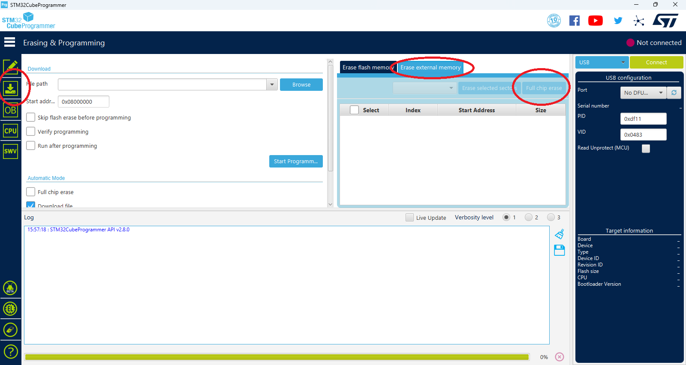

Once successfully erased, click the write icon on the left and click
'Open File'. Choose the octopus_canboot.bin file from earlier, and click
'Download'. Again, my screenshot is slightly off since I wrote this
documentation after the fact 😊

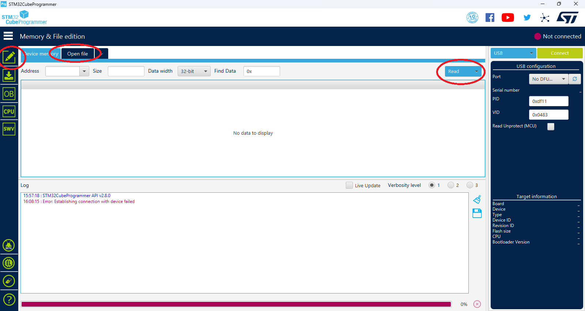

If everything goes well, you should see success messages. If this is the
case, click the 'Disconnect' button and unplug the board from computer.

Be aware of errors such as this. You may have to re-attempt or
investigate why it is happening. In this scenario, it was due to the
buggy 2.13 version of software, and the reason I rolled back to 2.8

**REMOVE** BOTH JUMPERS FROM 5V USB C AND BOOT0 PINS ON THE MCU

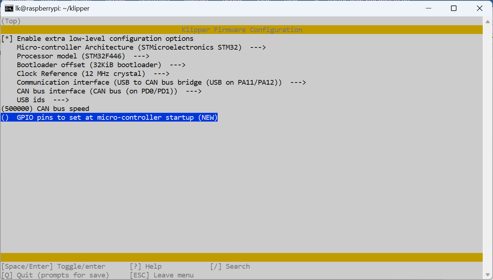

Repeat for the EBB42 board. Start by placing a jumper on the VBUS (near
usb-c socket) header pins and plug in the same USB cable for power.
Press and hold BOOT0, press and release RESET, release BOOT0 to enter
DFU mode.

Start STM32CubeProgrammer as before and follow the exact same steps of
erasing and re-writing the memory, only this time using the
ebb42_canboot.bin file. Once completed, remove the jumper from VBUS and
place it on the 120R pins.

**SET UP KLIPPER FIRMWARE**

Return to CMD and navigate to the Klipper directory, type: *'cd
\~/klipper'* and *'make menuconfig'*

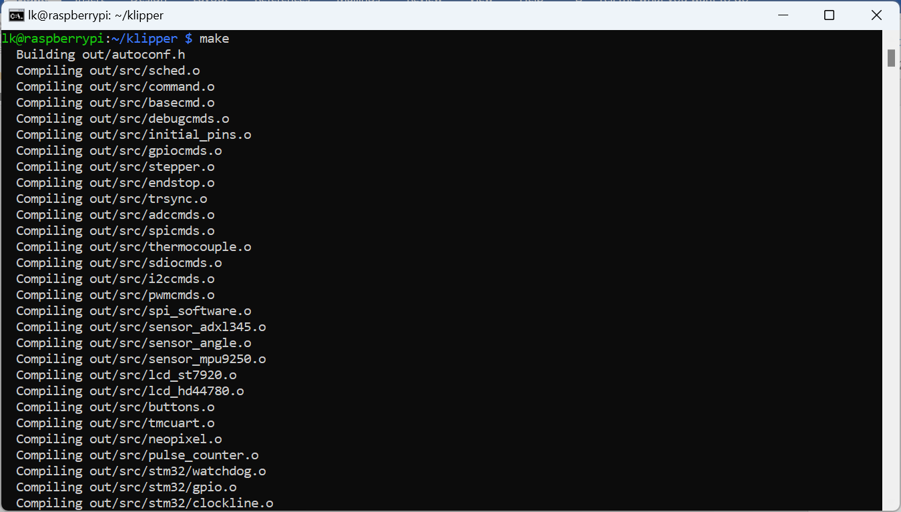

Here are the configuration settings for the F446 Octopus Pro. Note the
CAN bus speed must match what was specified earlier. Some other settings
are copied over from earlier.

Type: *'make'* to compile the Klipper firmware

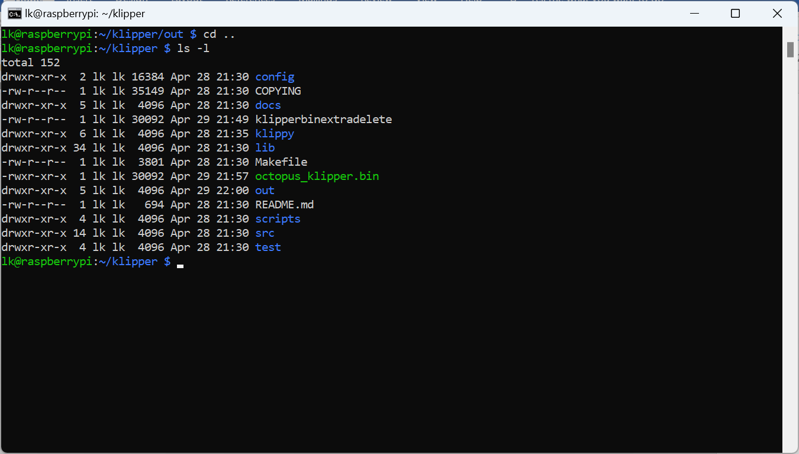

As before, rename the Klipper file to prevent overwriting in the next
step. Type: *'cd out'* followed by *'mv klipper.bin
octopus_klipper.bin'*. Move the file by typing: *'mv octopus_klipper.bin
\~\klipper'*

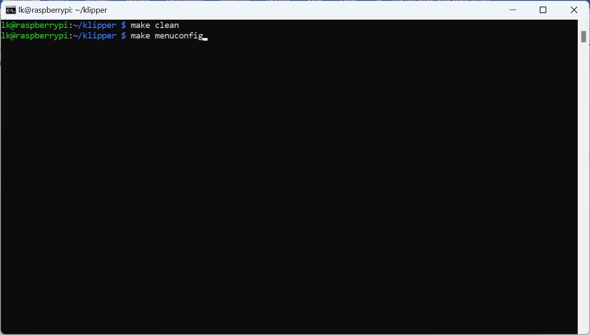

Type: *'cd ..'* and *'ls -l'* to make sure renamed file exists in the
parent Klipper directory.

Type: *'make clean'* and *'make menuconfig'* to repeat for the EBB36
board

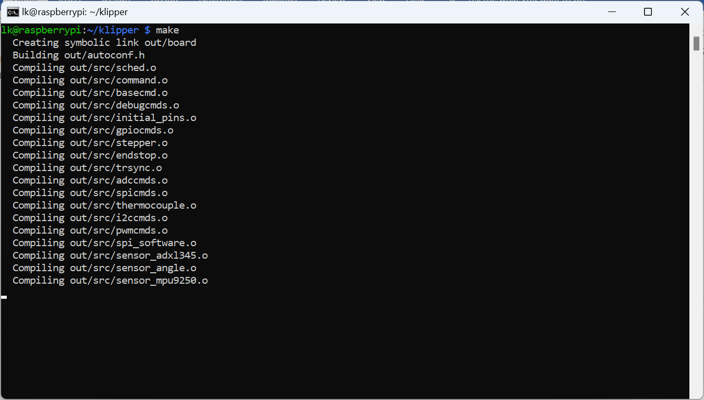

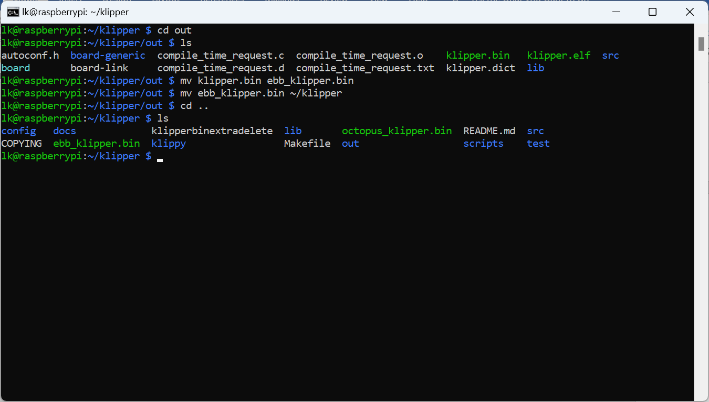

Quit, Save, and type: *'make'* to generate another firmware for the
EBB42 board.

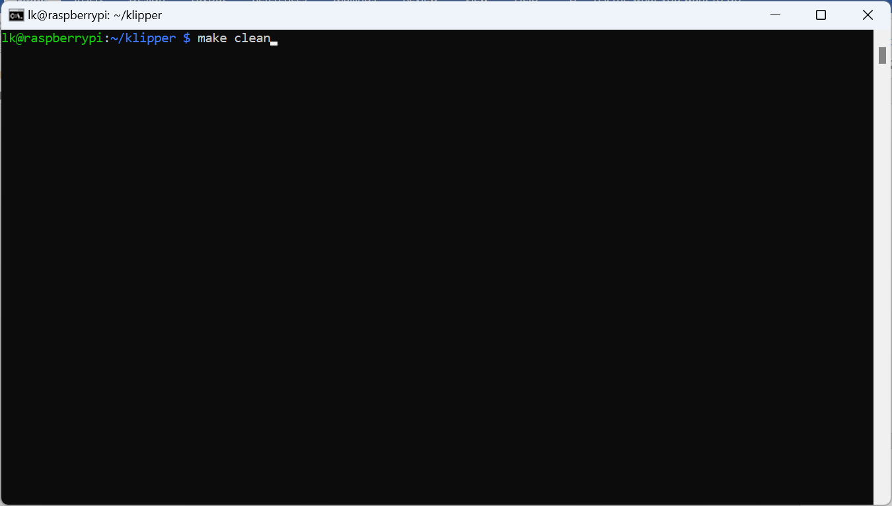

Repeat previous steps to rename and move ebb_klipper .bin file to parent
Klipper directory.

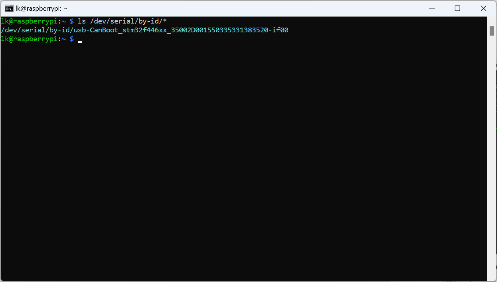

Type: *'make clean'*

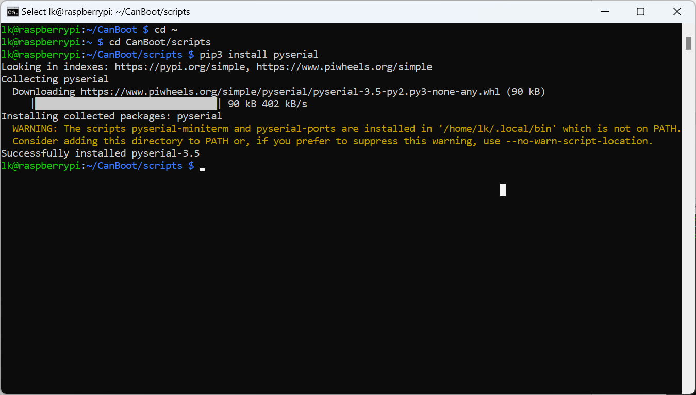

Plug in Octopus to Pi via USB A to C cable and power printer on. Use a
proper cable with data capability, some USB cables only provide power.
From CMD, type: *'ls /dev/serial/by-id/\*'* which returns the serial
device ID of the Octopus board. Copy this down.

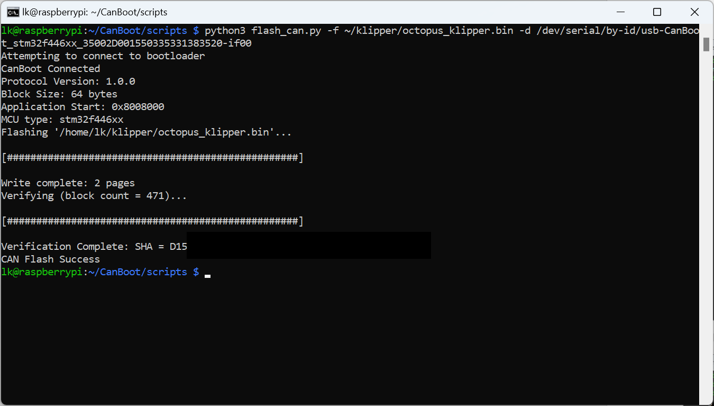

Type: *'cd CanBoot/scripts'* then *'pip3 install pyserial'*

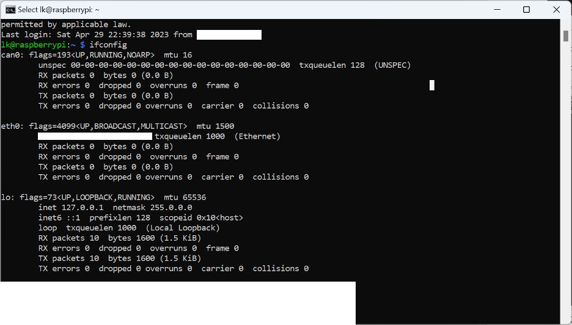

Type: '*python3 flash_can.py -f \~/octopus_klipper.bin -d (serial
number)*' to flash Octopus over serial.

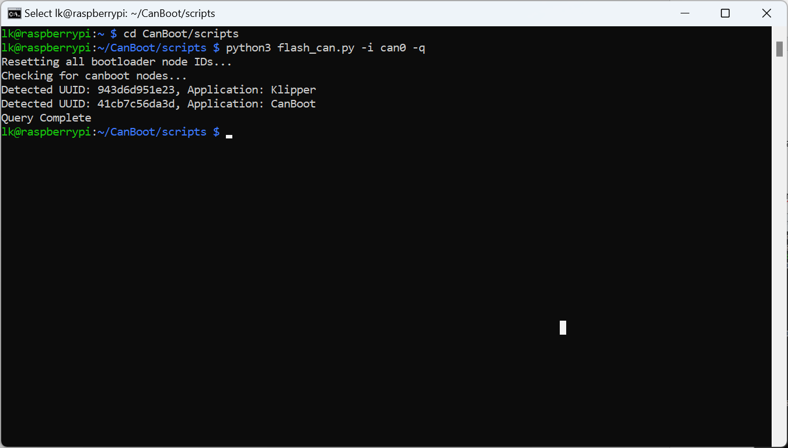

Type: *'cd'* then *'sudo nano /etc/network/interfaces.d/can0'*

Paste the following, once again noting that bitrate matches the speed
specified earlier if y.

allow-hotplug can0

iface can0 can static

bitrate 500000

up ifconfig \$IFACE txqueuelen 128

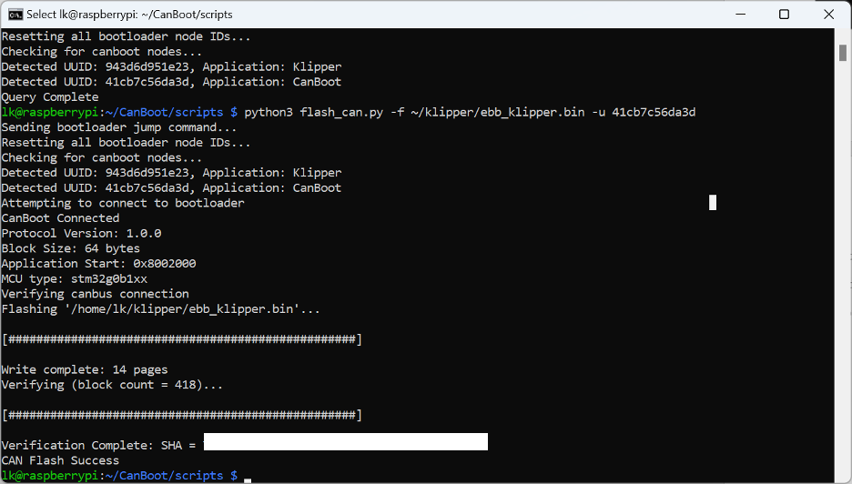

Press CTRL X to save and quit.

From CMD, type: 'sudo reboot'

Connect octopus with Ebb42 via RJ11 cable, you can power the ebb42 via
USB or via 24v pins.

From CMD, type: '*ifconfig'*. Look for the can0 entry.

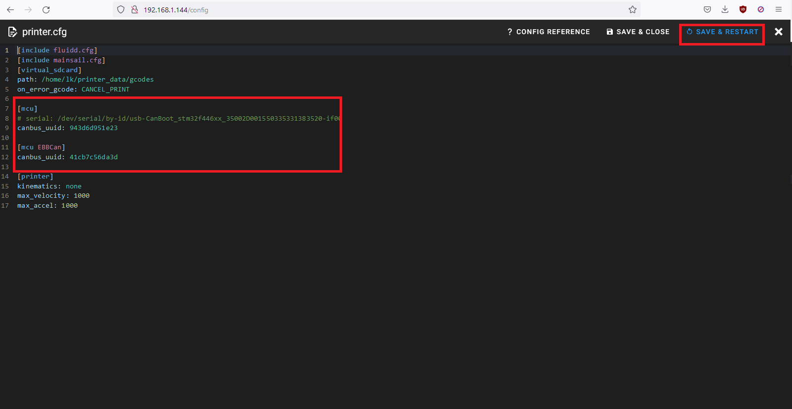
Type: *'cd CanBoot/scripts'* and *'python3 flash_can.py -i can0 -q'*
which now lists the UUID for both the Octopus and EBB42. The Klipper
label references Octopus, and CanBoot references the EBB42. Copy both
down.

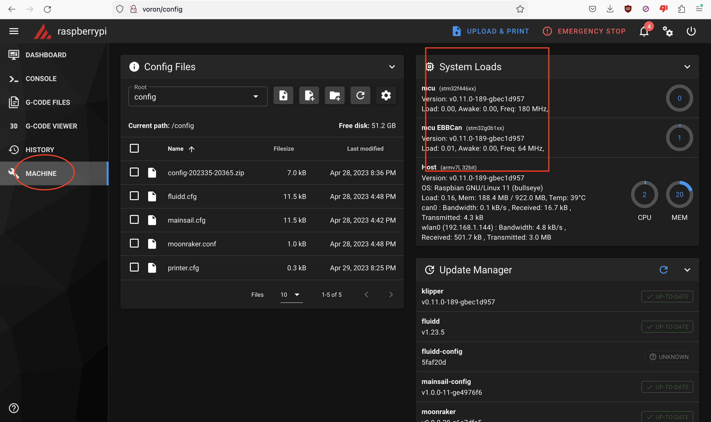

Type: '*python3 flash_can.py -f \~/klipper/ebb_klipper.bin -u (ebbID
canboot)'* to flash Klipper to the EBB36 board via CAN.

Load Mainsail, which may still show errors. Add both UUID from previous
step into the printer.cfg for each cfg file where you find
"canbus_uuid:". Click 'Save and Restart'. You may also need to do a
firmware restart.

Click 'Machine', check that both CAN UUIDs are present and you are done!
As with non-CAN installs, time to configure printer.cfg and continue
with set up/tuning. Best of luck!

